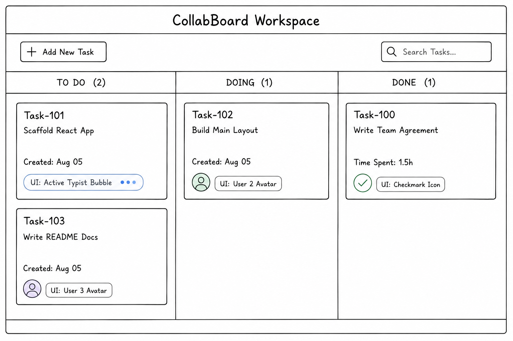

# CollabBoard

CollabBoard is a collaborative Kanban-style project and task management application developed as a progressively built full-stack group project.

The application is designed around project workspaces where users can view their projects, open a project-specific task board, and track work across three workflow stages:

- **To Do**
- **Doing**
- **Done**

The project is being developed incrementally across multiple milestones, beginning with the frontend structure and later introducing the backend API, authentication, database persistence, testing, real-time collaboration, and deployment.

---

## Milestone Status

### Milestone 1 — Static Front-End Skeleton

**Status: Completed**

Milestone 1 focuses on establishing the frontend structure of CollabBoard using React, reusable components, mock data, routing, a wireframe, and a documented component architecture.

The current version represents the completed frontend foundation before backend development begins.

---

## Implemented in Milestone 1

### Landing Page

- Responsive CollabBoard landing page
- Project-focused introduction
- Navigation to the project dashboard
- Navigation to the login interface

### Profile and Project Dashboard

- User profile display
- Editable profile details
- Profile photo selection and preview
- Client-side validation for profile information
- Profile information stored using `localStorage`
- Project search
- Project filtering by status
- Project filtering by starting month
- Project progress display
- Project member indicators

### Project Navigation

Each project has its own board route.

Selecting a project from the profile/dashboard opens the board associated with that specific project.

Example:

```text
/profile
   ↓
Select CollabBoard Launch
   ↓
/projects/project-1/board
```

### Kanban Board

- Reusable Board component
- Reusable Column components
- Reusable TaskCard components
- Three workflow columns:
  - To Do
  - Doing
  - Done
- Task count displayed for each column
- Mock task data
- Tasks associated with a specific project
- Empty-state display when a project has no tasks
- Responsive board layout

### Frontend Routing

React Router is used to manage navigation between the main application pages.

Current routes:

| Route | Purpose |
| --- | --- |
| `/` | Landing page |
| `/login` | Login interface |
| `/profile` | User profile and project dashboard |
| `/projects/:projectId/board` | Board belonging to a selected project |
| `/board` | Redirects users to the project dashboard |

---

## Current Application Flow

The frontend currently follows this structure:

```text
Landing Page
     │
     ├───────────────┐
     │               │
     ▼               ▼
Projects           Login
/Profile           Interface
     │
     ▼
Select Project
     │
     ▼
Project Board
     │
     ├── To Do
     ├── Doing
     └── Done
```

The login page is currently a frontend interface only.

Real authentication and protected routes will be introduced during Milestone 2.

---

## Component Tree

The Milestone 1 frontend is organized into reusable page and UI components.

```text
App
├── Navbar
│
├── Landing
│
├── Login
│
├── ProfilePage
│   ├── ProfileHeader
│   │   ├── Avatar
│   │   ├── Icon
│   │   └── EditProfileDialog
│   │
│   └── ProjectList
│       └── ProjectCard
│
└── BoardPage
    └── Board
        └── Column
            └── TaskCard
```

This structure separates page-level components from reusable interface components and makes the frontend easier to extend when the REST API and database are introduced.

---

## Project Structure

```text
collab-board-project/
│
├── public/
│
├── src/
│   │
│   ├── components/
│   │   ├── profile/
│   │   │   ├── Avatar.jsx
│   │   │   ├── Icons.jsx
│   │   │   ├── ProfileHeader.jsx
│   │   │   └── ProjectList.jsx
│   │   │
│   │   ├── Board.jsx
│   │   ├── Column.jsx
│   │   ├── Navbar.jsx
│   │   └── TaskCard.jsx
│   │
│   ├── data/
│   │   ├── mockData.js
│   │   └── profileData.js
│   │
│   ├── pages/
│   │   ├── BoardPage.jsx
│   │   ├── Landing.jsx
│   │   ├── Login.jsx
│   │   └── ProfilePage.jsx
│   │
│   ├── App.jsx
│   ├── index.css
│   └── main.jsx
│
├── Wireframe.png
├── index.html
├── package.json
├── package-lock.json
└── README.md
```

---

## Mock Data Structure

Milestone 1 currently uses local mock data instead of a backend database.

Project data is stored in:

```text
src/data/profileData.js
```

Task data is stored in:

```text
src/data/mockData.js
```

Each task contains a `projectId`, allowing the frontend to display only the tasks associated with the selected project.

Example relationship:

```text
Project
   │
   └── Tasks
        ├── Task 1
        ├── Task 2
        └── Task 3
```

This structure prepares the frontend for API and MongoDB integration in later milestones.

---

## Technology Stack

### Frontend

- React
- Vite
- JavaScript
- React Router DOM
- Tailwind CSS

### Development and Version Control

- Git
- GitHub
- ESLint
- npm

Backend and database technologies will be introduced during the next milestones.

---

## Design and Wireframe

A wireframe was created before the main board implementation to establish the layout of the CollabBoard workspace.

The wireframe defines the basic Kanban structure, including:

- Add Task interface
- Task search area
- To Do column
- Doing column
- Done column
- Task cards
- User/activity indicators
- Task progress information



The final frontend has evolved from the initial wireframe while preserving its main Kanban-board structure.

---

## Local Development

### Prerequisites

Make sure the following are installed:

- Node.js
- npm
- Git

### 1. Clone the Repository

```bash
git clone https://github.com/ramesha-dissanayake/collab-board-project.git
```

### 2. Open the Project Folder

```bash
cd collab-board-project
```

### 3. Install Dependencies

```bash
npm install
```

### 4. Start the Development Server

```bash
npm run dev
```

Vite will provide a local development URL in the terminal.

---

## Available Scripts

### Start Development Server

```bash
npm run dev
```

### Run ESLint

```bash
npm run lint
```

### Create Production Build

```bash
npm run build
```

---

## Git Workflow

Development is completed using separate feature or refactor branches rather than making changes directly on `main`.

The general workflow is:

```text
main
  │
  ├── feature/...
  │
  ├── feature/...
  │
  └── refactor/...
          │
          ▼
     Pull Request
          │
          ▼
        main
```

Changes are reviewed through pull requests before being merged into the main branch.

This keeps the Git history clear and makes individual pieces of work and team contributions visible.

---

## Current Client-Side Persistence

The profile page currently uses browser `localStorage` to preserve edited profile information after a refresh.

This includes information such as:

- Name
- User ID
- Age
- Description
- Profile image data

This is currently limited to profile information.

Full client-side caching/offline support for project and task data will be introduced in a later milestone.

---

## Known Limitations

The current application represents the completed Milestone 1 frontend foundation.

The following features are intentionally not implemented yet:

- User registration is not yet implemented
- Login does not currently authenticate against a server
- Routes are not yet protected by authentication
- Project and task data currently use mock data
- Projects cannot yet be created through a backend API
- Tasks cannot yet be created through a backend API
- Tasks cannot yet be edited or deleted
- Tasks cannot yet be moved between workflow states
- Task search is not yet functional
- MongoDB persistence has not yet been implemented
- Server-side data validation has not yet been implemented
- Concurrent edit detection has not yet been implemented
- Real-time Socket.io synchronization has not yet been implemented
- Automated client and server tests have not yet been implemented
- GitHub Actions CI has not yet been implemented
- Docker and Docker Compose have not yet been implemented
- The application has not yet been deployed as the completed full-stack system

These features belong to the upcoming project milestones rather than the Milestone 1 static frontend.

---

## Milestone 2 — Next Development Stage

The next stage of CollabBoard will introduce the backend and connect the frontend to real application data.

Planned Milestone 2 work includes:

- Node.js backend
- Express REST API
- Routes/controllers/models architecture
- User registration
- User login
- Password handling
- JWT authentication
- Protected routes
- Project API endpoints
- Task CRUD API endpoints
- Connecting the React frontend to the REST API
- Replacing relevant mock data with API responses
- API contract documentation

The backend architecture will preserve the frontend relationship established during Milestone 1:

```text
User
  │
  └── Projects
        │
        └── Tasks
              │
              ├── To Do
              ├── Doing
              └── Done
```

---

## Future Milestones

Following the REST API milestone, CollabBoard will progressively introduce:

```text
MongoDB + Mongoose
        ↓
Client-side caching / offline support
        ↓
Automated client and server testing
        ↓
GitHub Actions CI
        ↓
Socket.io real-time synchronization
        ↓
Concurrent edit handling
        ↓
Docker Compose
        ↓
Public deployment
```

---

## Project Goal

The final goal of CollabBoard is to provide a full-stack collaborative task board where authenticated team members can manage projects and tasks, track work across Kanban stages, persist project data, and receive updates from other connected users in real time.